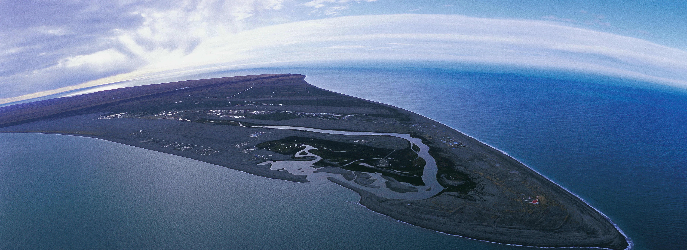

## 📬 Contacto / Contact
- **Email:** [haroldohorta@gmail.com](mailto:haroldohorta@gmail.com)
- **Web:** [haroldohorta.github.io/atlas](https://haroldohorta.github.io/atlas/)

---

## 💝 Apoya este Proyecto / Support this Project

Este archivo vive gracias al esfuerzo independiente de preservar 50 años de memoria histórica. Cada aporte ayuda a mantener vivos estos 28TB y a continuar documentando Sudamérica.

**💙 PayPal:** 

---

  <h3>Desarrollado con sentido y amor en medio de una tormenta en Junín, Argentina, 2026.</h3>
  

