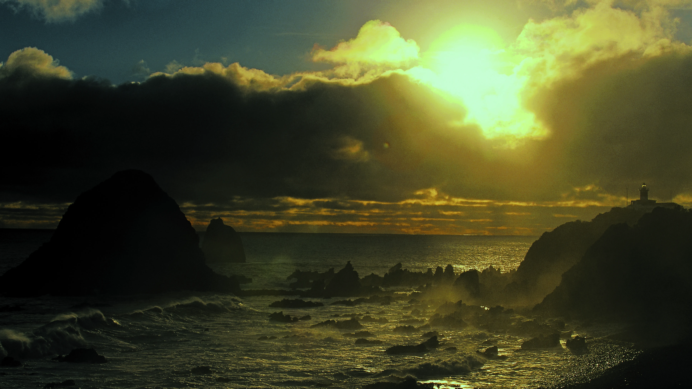
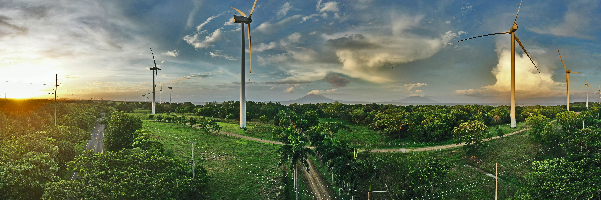
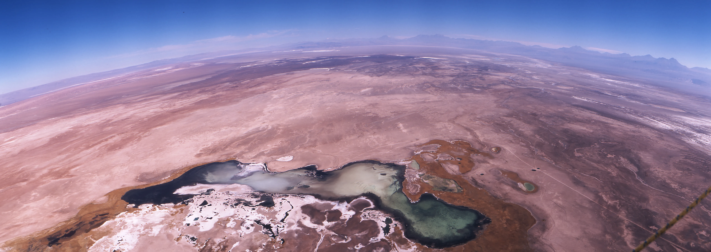
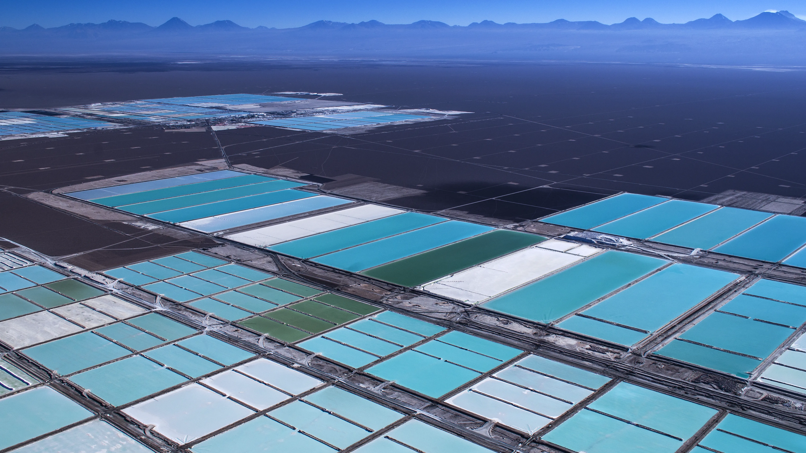
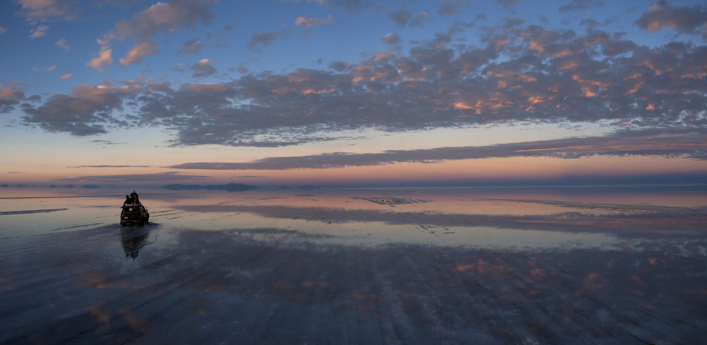

  
  
   
  <h1>📷 HAROLDO HORTA 📷</h1>
  <h3>50 Años de Memoria Visual / 50 Years of Visual Memory</h3>
  
  

    <i>"No solo capturar la imagen, sino rescatar la esencia humana que habita en ella."</i>
  

  

    <a href="#-español">🇪🇸 Español</a> | 
    <a href="#-english">🇺🇸 English</a> | 
    <a href="#-português">🇧🇷 Português</a>
  

  
  
  

   
  <a href="https://haroldohorta.github.io/atlas/">
    <h1>🌍 [ ACCEDER AL ATLAS / ACCESS THE ATLAS ] 🌍</h1>
  </a>
   

---

## 🇪🇸 Español
### 🗺️ El Ojo Nómada: Archivo Haroldo Horta

Este repositorio no es solo una galería; es un acto de **resistencia contra el olvido**. Contiene el trabajo de vida de Haroldo Horta, fotógrafo documental que ha recorrido América Latina capturando los momentos donde la historia y la humanidad colisionan.

Desde las trincheras de la Revolución en Centroamérica hasta el silencio blanco de la Antártida, este archivo digitaliza y geolocaliza miles de negativos y archivos digitales para devolverlos al patrimonio común.

#### 📂 Ejes de la Colección:
* **🔥 Fuego y Revolución (Centroamérica):** Testimonio directo de la insurrección sandinista en Nicaragua y el conflicto en El Salvador. La vida cotidiana en medio de la guerra.
* **🏔️ Raíces y Andes (Pueblos Originarios):** Un registro antropológico y visual de las comunidades Pehuenches, Aymaras y la vida en el altiplano.
* **🌊 Confines (Chile y Antártida):** La soledad de los Faros de Chile y la inmensidad del territorio antártico.

[↑ Volver al inicio](#-español)

---

## 🇺🇸 English
### 🗺️ The Nomadic Eye: Haroldo Horta's Archive

This repository is not just a gallery; it is an act of **resistance against oblivion**. It holds the lifework of Haroldo Horta, a documentary photographer who has traversed Latin America capturing moments where history and humanity collide.

From the trenches of the Revolution in Central America to the white silence of Antarctica, this archive digitizes and geolocates thousands of negatives and digital files to return them to our common heritage.

#### 📂 Collection Pillars:
* **🔥 Fire & Revolution (Central America):** A first-hand witness to the Sandinista insurrection in Nicaragua and the conflict in El Salvador. Daily life amidst war.
* **🏔️ Roots & Andes (Indigenous Peoples):** An anthropological and visual record of the Pehuenche and Aymara communities, and life in the high Andean plateau.
* **🌊 The Edges (Chile & Antarctica):** The solitude of Chilean Lighthouses and the immensity of the Antarctic territory.

[↑ Back to top](#-español)

---

## 🇧🇷 Português
### 🗺️ O Olho Nômade: Arquivo Haroldo Horta

Este repositório não é apenas uma galeria; é um ato de **resistência contra o esquecimento**. Contém a obra de vida de Haroldo Horta, fotógrafo documental que percorreu a América Latina capturando momentos onde a história e a humanidade colidem.

Das trincheiras da Revolução na América Central ao silêncio branco da Antártida, este arquivo digitaliza e geolocaliza milhares de negativos e arquivos digitais para devolvê-los ao patrimônio comum.

#### 📂 Eixos da Coleção:
* **🔥 Fogo e Revolução (América Central):** Testemunho direto da insurreição sandinista na Nicarágua e o conflito em El Salvador.
* **🏔️ Raízes e Andes (Povos Originários):** Um registro antropológico das comunidades Pehuenches, Aymaras e a vida no altiplano.
* **🌊 Confins (Chile e Antártida):** A solidão dos Faróis do Chile e a imensidão do território antártico.

[↑ Voltar ao topo](#-español)

---

## ⚖️ Licencia / License / Licença

Este trabajo está protegido para asegurar que la memoria sea libre pero respetada.
*This work is protected to ensure memory remains free but respected.*

**Creative Commons Atribución-NoComercial-SinDerivadas 4.0 (CC BY-NC-ND 4.0)**.

> **⛔ No Comercial:** Prohibida la venta de estas imágenes.
> **⛔ Sin Derivadas:** Las fotos deben mantenerse íntegras, sin ediciones que alteren su verdad histórica.
> **✅ Atribución:** Siempre citar a **Haroldo Horta** como autor.

---

## 🛡️ Rescate Patrimonial / Heritage Rescue

Este archivo representa la **Trayectoria #00** de la iniciativa de rescate de memoria impulsada por **SUR DAO**.
*This archive represents **Trajectory #00** of the memory rescue initiative powered by **SUR DAO**.*

> **SUR DAO:** Tecnología descentralizada al servicio de la Memoria Histórica.
>  
> [**🔗 Visitar Repositorio Oficial SUR DAO (Nave Madre)**](https://github.com/TIANHH77/Sur-DAO)

---

## 📬 Contacto / Contact
- **Email:** [haroldohorta@gmail.com](mailto:haroldohorta@gmail.com)
- **Web:** [haroldohorta.github.io/atlas/](https://haroldohorta.github.io/atlas/)

 

  <h3>Desarrollado con sentido y amor en medio de una tormenta en Junín, 2026.</h3>
  
  

